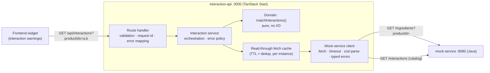
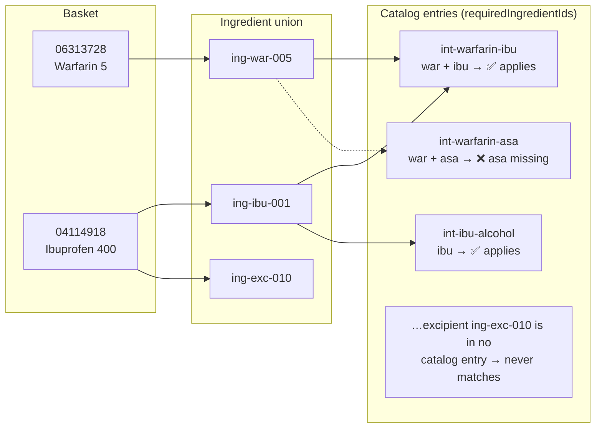
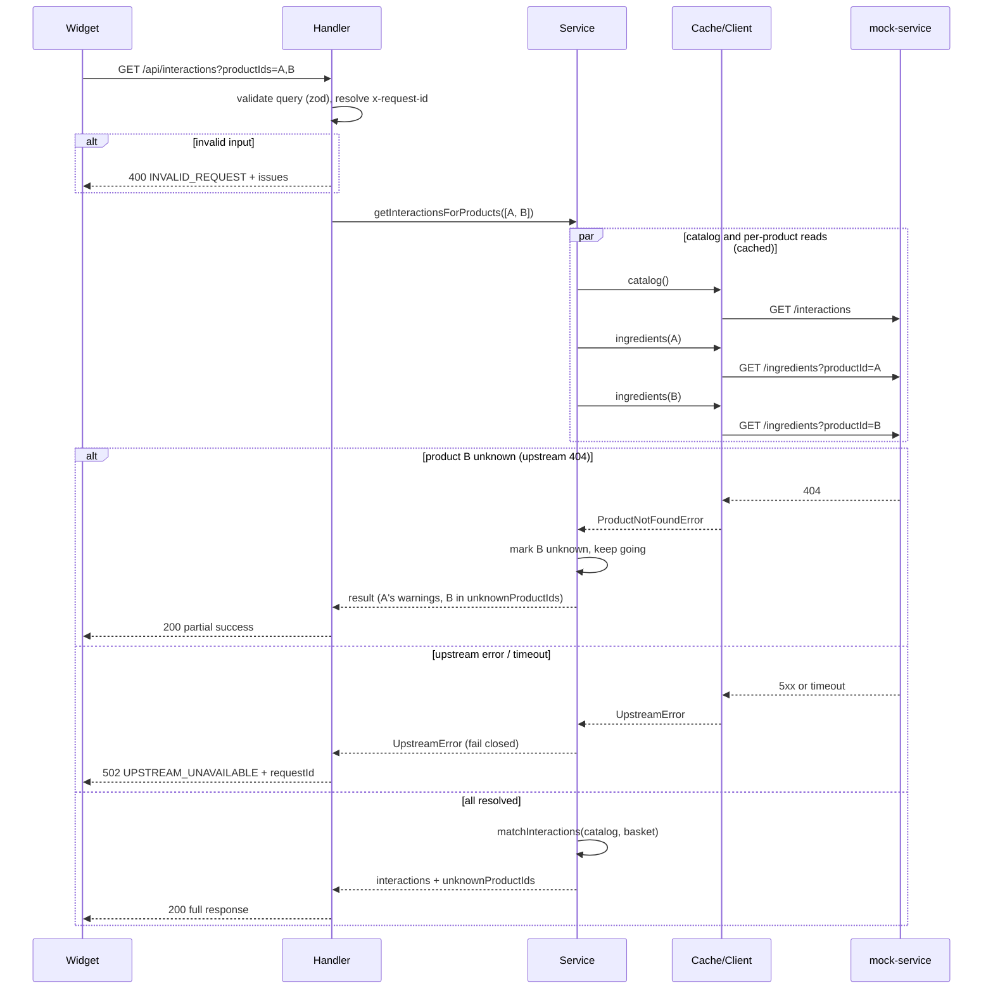

# Architecture

## System overview

The interaction-api is a backend-for-frontend: it aggregates the catalog and one ingredient read per product into the single response the widget needs.

The upstream's `GET /product` (name, description) is deliberately unused: the caller already knows the products it asked about, so fetching their names would double the reads per request to return data it already has. See decision 6.

Layering rules:

- **Route files** (`src/routes/api/*`) contain no logic; they wire plain `(Request) => Response` handlers into TanStack Start.
- **Handlers** validate input (zod), manage the request id, and map service outcomes/errors to HTTP.
- **The service** orchestrates: it fetches the interaction catalog and the per-product ingredient lists in parallel, all through the cache; it owns the partial-success vs fail-closed policy.
- **The domain module** is a pure function — the entire business rule (an interaction applies iff all required ingredient ids appear in the union of the basket's ingredients) with no I/O or framework imports.
- **The client** is the only place that talks HTTP to the upstream: per-request timeout (`AbortSignal.timeout`), zod-validated bodies, and typed errors (`ProductNotFoundError`, `UpstreamError`) so upper layers never inspect status codes.

## Interaction matching

The domain rule: an interaction applies iff **every** one of its `requiredIngredientIds` is present in the union of ingredients across the basket. Example with the mock data, basket `06313728` (Warfarin 5) + `04114918` (Ibuprofen 400):

Each applying entry becomes one `interactions[]` element in the response, with `involvedProductIds` listing the basket products that contributed the required ingredients (here `int-warfarin-ibu` involves both products, `int-ibu-alcohol` only `04114918`).

## Caching

All upstream reads go through `src/server/fetch-cache.ts`, a small read-through cache over the client's fetches (no dependency):

- Each key is cached for a TTL — the catalog and per-product ingredient lists default to 30 s (`CATALOG_TTL_MS`, `PRODUCT_TTL_MS`), because data can change independently of deployments.
- Concurrent requests for the same key are deduplicated into one upstream fetch: callers share the in-flight promise.
- Failures are never cached — a rejected fetch is dropped from the cache, so upstream errors surface immediately, the API fails closed, and the next request retries.
- Expired entries are swept once the cache grows past its cap, bounding it to the keys read within one TTL window.
- The cache is per instance, which stays correct when multiple instances run — each instance is at most one TTL behind.

## Request flow

## Observability

- Structured one-line JSON logs (level, timestamp, message, fields):
  - a startup line with the resolved configuration when the handler chain is first built;
  - one line per `/api/interactions` request — served (with counts and duration), rejected as invalid (warn), failed upstream (error, 502), or unexpected error (error, 500);
  - with `LOG_LEVEL=debug`, one line per upstream fetch (path, status, duration) — since reads are cached, these are effectively cache-miss logs.
- Every response carries an `x-request-id` (honoured from the request or generated), echoed in error bodies and attached to the request logs for cross-service correlation.
- `GET /api/health` as a liveness probe (deliberately unlogged to keep probe noise out of the logs).
