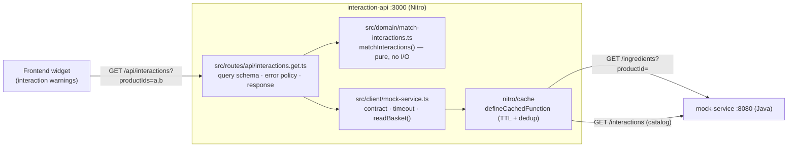
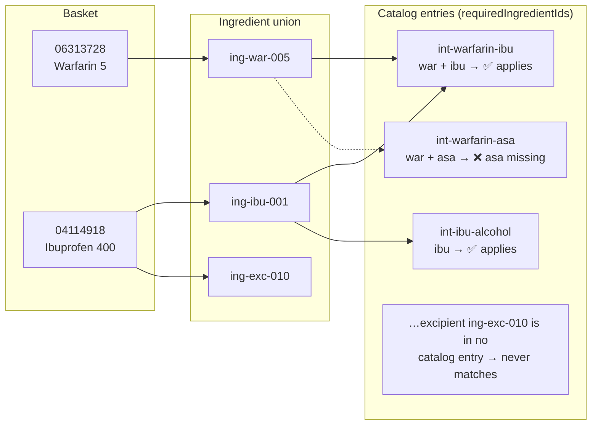
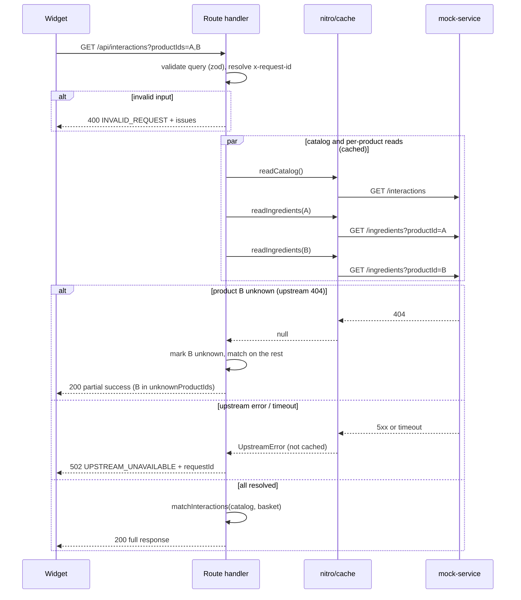

# Architecture

## System overview

The interaction-api is a backend-for-frontend: it aggregates the catalog and one ingredient read per product into the single response the widget needs.

The upstream's `GET /product` (name, description) is deliberately unused: the caller already knows the products it asked about, so fetching their names would double the reads per request to return data it already has. See decision 7.

Each module owns one thing, and nothing exists purely to connect two others:

- **The route file** owns this endpoint: the query schema, the mapping of outcomes to 200/400/500/502, and the response body. It reads as one request from top to bottom.
- **The client** owns the upstream: its zod contract, its timeout, its cached reads, `readBasket()` for the per-product fan-out, and the `UpstreamError` that everything-except-404 becomes. It is the only file that knows the mock service exists.
- **The domain module** is a pure function — the entire business rule (an interaction applies iff all required ingredient ids appear in the union of the basket's ingredients) with no I/O or framework imports. It is the part worth unit-testing on its own, and the part that would survive any rewrite of the transport.
- **The two utilities** are endpoint-agnostic: `http.ts` (request-id validation, JSON responses, the shared error body) and `logger.ts` (consola with a JSON reporter), both shared by the route and the client.

The modules import each other directly by name: there is nothing to configure and nothing to inject.

Tests substitute the *process* rather than the module. `src/test/upstream-server.ts` is a real `node:http` server speaking the mock service's contract, so the client and the route are exercised over real sockets with `fetch` untouched. In the diagram above, only the `mock-service :8080` box is replaced — everything inside `interaction-api`, including `nitro/cache`, is the real thing.

## Interaction matching

The domain rule: an interaction applies iff **every** one of its `requiredIngredientIds` is present in the union of ingredients across the basket. Example with the mock data, basket `06313728` (Warfarin 5) + `04114918` (Ibuprofen 400):

Each applying entry becomes one `interactions[]` element in the response, with `involvedProductIds` listing the basket products that contributed the required ingredients (here `int-warfarin-ibu` involves both products, `int-ibu-alcohol` only `04114918`).

## Caching

Both upstream reads are wrapped in [`defineCachedFunction`](https://nitro.build/guide/cache) from `nitro/cache` — the platform already implements exactly the caching this service needs, so there is no cache code to own:

- Each key is cached for 30 s — `catalog` for the interaction catalog, the product id for an ingredient list — because that data changes independently of deployments.
- Concurrent requests for the same key are deduplicated into one upstream fetch: callers share the in-flight promise.
- Failures are never cached — a rejected call is evicted, so upstream errors surface immediately, the API fails closed, and the next request retries.
- `swr: false` is load-bearing: under Nitro's default an expired entry plus a failing upstream *resolves with the stale value* and demotes the error to a log line, with no bound on staleness while `staleMaxAge` is unset. That would silently invert decision 8's fail-closed policy.
- A 404 caches as `null` — an unknown product is a stable data fact, not a failure.
- Storage is Nitro's `cache` mount point: in-memory per instance by default, which stays correct with multiple instances (each is at most one TTL behind), and swapping in a shared Redis cache is a `nitro.config.ts` change rather than a code change.

## Request flow

## Observability

- Structured one-line JSON logs via consola and a single JSON reporter (level, timestamp, message, fields):
  - one line per `/api/interactions` request — served (with counts and duration), rejected as invalid (warn), failed upstream (error, 502), or unexpected error (error, 500);
  - with `LOG_LEVEL=debug`, one line per upstream fetch (path, status, duration) — since reads are cached, these are effectively cache-miss logs.
- Every response carries an `x-request-id` (honoured from the request if it matches `/^[\w.:-]{1,128}$/`, generated otherwise), echoed in error bodies and attached to the request logs for cross-service correlation.
- There is no `/api/health` route: the container has one endpoint, and a probe against `/api/interactions` tells you something a hard-coded `{"status":"ok"}` cannot. Adding one back is a four-line route file if an orchestrator ever needs a dependency-free liveness check.
- Two routes exist besides the endpoint itself, in dev and in production alike: `/_openapi.json` (the OpenAPI 3.1 document, generated from metadata declared in the route file) and `/_swagger` (Swagger UI over it). See decision 14 — including why the metadata is attached to the handler rather than declared with Nitro's `defineRouteMeta()` macro.
